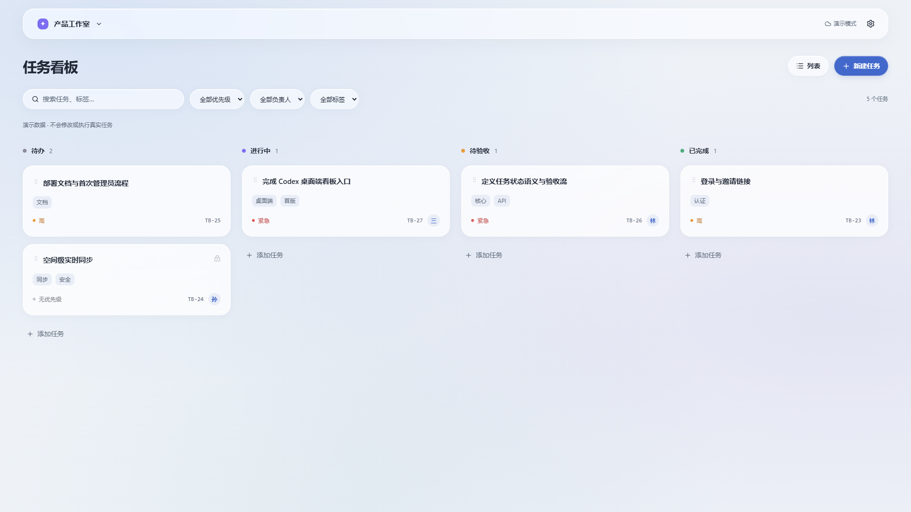

# Codex Taskboard

[English](README.en.md) · [交接文档](HANDOFF.md) · [架构](docs/architecture.md) · [部署](docs/deployment.md) · [开发](docs/development.md) · [验收记录](docs/acceptance.md)

嵌入 Codex 桌面版的任务协作层。把待办、进度与验收放在同一个看板中，让个人多设备和可信团队共享任务；Codex 继续管理原有项目和执行会话。

> 当前为 **0.1.0 开发预览**。演示界面、真实服务端测试与桌面实机兼容性分别验收；尚未通过实机发布门槛的构建不标记稳定版。详见验收记录。

**当前可用的是浏览器看板与服务端、CLI/伴随服务开发实现。Codex 原生侧栏内嵌和项目草稿导航尚不支持，Windows 安装包尚未验收。**



## 功能

- 自定义工作/个人空间、任务状态列与成员权限。
- 看板、列表、Markdown 详情、评论、检查清单和活动记录。
- PostgreSQL 集中存储，按空间实时通知，版本冲突提示和幂等提交。
- 通过 Skill + `taskctl` 领取、回写和提交验收；桌面草稿入口在能力未验证时明确停止。
- 每台设备独立映射已有项目目录；任务可关联多次执行会话。
- 浅色、深色、系统主题，中文界面，邀请制自部署。

最新桌面源码支持在登录页填写并保存服务器地址，之后再登录；同一实例的不同设备使用相同地址。详见 [Windows 桌面使用说明](docs/desktop.md)。此增量尚未包含在此前生成的开发预览安装包中。

## 快速预览

需要 Node.js 22.16+ 和 pnpm 10.28.0：

```sh
pnpm install --frozen-lockfile
pnpm dev:web
```

在 Chrome 打开 [交互演示](http://127.0.0.1:4173/?demo=1)。演示使用合成数据，不连接服务器、不调用 Codex。

## 运行真实服务

配置 PostgreSQL 连接及会话密钥后启动。完整操作见 [开发说明](docs/development.md)。

```sh
cp .env.example .env
pnpm db:migrate
pnpm admin bootstrap --email owner@example.com --name Owner
pnpm dev
```

Windows 可用 `Copy-Item .env.example .env`。管理员密码通过标准输入或环境变量提供，至少 12 字符。打开 Web 登录，创建首个空间，再邀请成员；默认没有公开注册。

生产使用 [Docker Compose 部署](docs/deployment.md)，包含应用、PostgreSQL 与 Caddy HTTPS。正式镜像发布前可从源码构建。

## Codex 接入

看板负责任务，Codex 负责本机项目。打开任务草稿不会自动发送，也不会自动领取。Agent 开始工作时通过 CLI 原子领取，验证后提交待验收；用户验收后完成。

本机伴随服务保存仓库到目录的映射并保护设备凭据。项目绝对路径和完整会话不会自动上传。具体启动、配置、卸载与限制见 [桌面接入](docs/desktop.md)。

## 兼容范围

| 组件                   | 首版目标                     | 验证状态               |
| ---------------------- | ---------------------------- | ---------------------- |
| 浏览器看板             | Chrome，1280×800 / 1920×1080 | 见验收记录             |
| 服务端                 | Linux amd64 / PostgreSQL 16+ | 见验收记录             |
| 桌面启动器             | Windows x64                  | 需安装包与实机验收     |
| Codex 内嵌             | 26.901.5280.0 验证基线       | 能力探测失败时停止注入 |
| Codex CLI / 其他 Agent | 后续版本                     | 首版保留接口           |

共享的是任务内容与执行摘要，完整 Codex 会话是否能打开取决于原设备和宿主能力。首版不提供自动排队调度、GitHub 数据同步或完整离线编辑。

## 验证与维护

```sh
pnpm exec playwright install chromium
pnpm check
pnpm test:db
pnpm test:e2e
pnpm test:offline
pnpm desktop:diagnose
```

`test:db` 在项目 `.data` 下启动独立本机 PostgreSQL，不使用生产数据库。CI 使用专用 PostgreSQL 服务。桌面诊断无法连接受管理的 Codex 时会明确失败，而非报告兼容。

`test:offline` 需要已构建的 Web 和独立测试数据库，验证缓存页面后真正关闭、断网重开浏览器。离线只读缓存需要此前成功联网访问；联网后重新校验权限，不支持离线领取或保存任务。

欢迎通过 Issue 与 fork PR 参与。主仓库合并、标签和发布由 [@i-am-yimin](https://github.com/i-am-yimin) 维护；自动化只准备构建产物和草稿 Release。参见 [贡献指南](CONTRIBUTING.md) 和 [安全说明](SECURITY.md)。

MIT License。独立实现，产品行为参考 [dashi-taskboard](https://github.com/chuspeeism/dashi-taskboard)，未复制其源码或素材。本项目为社区工具，不代表 OpenAI 官方产品。
