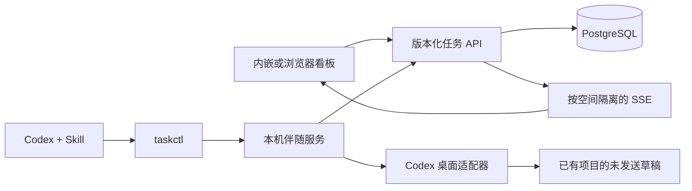

# 架构

任务看板管理任务生命周期，Codex 管理本机项目与会话。任务中的 repository 只是去除凭据后的仓库标识，不是另一套项目管理。每台设备把同一标识映射到自己的目录。

## 模块边界

`packages/core` 定义数据类型、输入约束、权限序和 AgentAdapter；不访问网络、数据库或 Codex。`apps/server` 负责鉴权、SQL 事务、幂等和空间隔离。`apps/web` 显示状态并保存草稿，不推测执行状态。`apps/companion` 保存设备状态、保护凭据并中转 Agent 请求。`packages/adapter-codex` 封装宿主能力探测和界面桥接。`packages/cli` 输出机器可读结果。`apps/desktop` 打包并管理本机进程。

## 数据一致性

PostgreSQL 是共享任务的唯一权威来源。任务写入携带版本号，重复请求使用相同幂等键。冲突必须重新读取并由调用者合并。领取在数据库事务中完成，不能使用前端检查代替原子约束。SSE 仅作为变更通知，重连后从 API 获取当前状态。

离线缓存只用于浏览，草稿不会冒充服务器状态。离线不得领取任务；已执行结果可保留待提交记录，重试必须保留原版本和幂等键。权限撤销及登出清理对应缓存。

浏览器通过 EventSource 订阅空间事件。桌面通过带本机能力凭据的 fetch 读取伴随服务 SSE，远程账号凭据留在伴随服务中。断开后重连并刷新当前版本；伴随服务返回的离线缓存元数据必须保留到 UI 的只读状态。生产浏览器仅缓存根页面及构建资源，账号快照独立按身份管理；首次联网缓存完成后才支持完全断网重开。

## 扩展

首版只维护服务器后端及 Codex 桌面适配器。未来 CLI/MCP 接入调用现有 API；新 Agent 声明自己支持的能力。GitHub 同步需要单独 ADR 确定冲突与凭据策略，不提前承诺与服务器模式相同的实时性。
